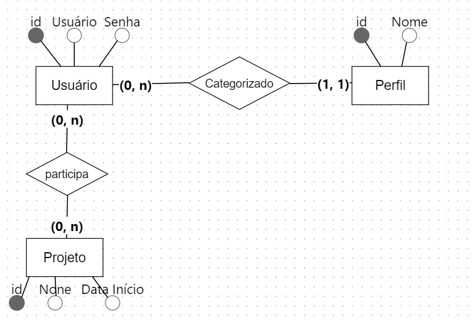

# Aula 02 Sql-Alchemy

## Parte 1: Rotas para o Usuário

Demonstração no código! 

## Parte 2: Modelagem de Relacionamentos n para n

Partindo do projeto criado na aula passada, vamos realizar modificações no Banco de Dados



Para implementar um relacionamento n para n devemos seguir os seguintes passos:

(a) Criar o modelo da classe `Projeto`
```python
class Projeto(db.Model):
    __tablename__ = 'projeto'

    id = db.Column(db.Integer, primary_key=True)
    nome = db.Column(db.String(20), unique=True, index=True)
    inicio = db.Column(db.Date, default=date.today())
    
    def __repr__(self):
        return f"Projeto: {self.nome}"
```

(b) Criar uma representação para a tabela de relacionamentos
```python
usuario_projeto = db.Table('usuario_projeto',
            db.Column('usuario_id', db.Integer, db.ForeignKey('usuario.id')),
            db.Column('projeto_id', db.Integer, db.ForeignKey('projeto.id'))
            )
```
(c) Adicionar o relacionamento na classe Projeto (é possível add esse relacionamento na classe Usuario também)
```python
class Projeto(db.Model):
    __tablename__ = 'projeto'

    id = db.Column(db.Integer, primary_key=True)
    nome = db.Column(db.String(20), unique=True, index=True)
    inicio = db.Column(db.Date, default=date.today())
    participantes = db.relationship('Usuario', secondary=usuario_projeto, backref='participantes')

    def __repr__(self):
        return f"Projeto: {self.nome}"
```

Agora podemos criar Projetos e fazer relações entre usuários e projetos
```python
joao = Usuario(usuario='joao123', senha='jj112', perfil=admin)
susan = Usuario(usuario='susan', senha='su21', perfil=usuario)
denise = Usuario(usuario='denise99', senha='deni456', perfil=moderador)

p1 = Projeto(nome="Sistema 01", inicio=date(2023, 7, 12))
p2 = Projeto(nome="Sistema 02")

p1.participantes.append(susan)
p1.participantes.append(joao)

p2.participantes.append(denise)
p2.participantes.append(joao)

db.session.add_all([joao, susan, denise, p1, p2])
db.session.commit()
```


